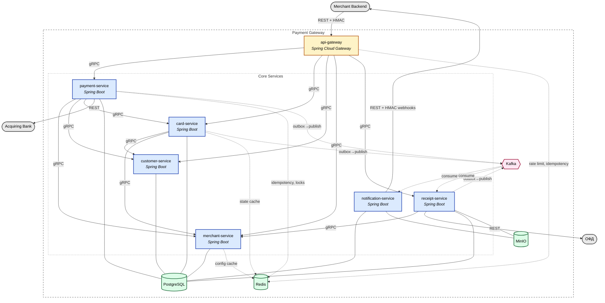

# Payment gateway

> Self-hosted payment gateway built as a learning project, architecturally 
> modeled after Stripe, Adyen, and Tinkoff Acquiring. Focuses on distributed 
> systems patterns, payment domain modeling, and production-grade reliability.

## Overview

Payment gateway exposing a REST API to merchants for card payments, 
tokenization, recurring charges, refunds, and fiscal receipts. 
Communicates with merchants exclusively via signed webhooks.

**Public API:** [sergeevoa.github.io/payment-gateway](https://sergeevoa.github.io/payment-gateway/)

## Architecture

High-level component diagram showing services, protocols, and data flows:


### Services

| Service | Responsibility
|---|---|
| `api-gateway` | TLS termination, HMAC validation, rate limiting, routing
| `merchant-service` | Merchants, terminals, API keys, webhook settings
| `payment-service` | Payment state machine, `Init`/`FinishAuthorize`/`Confirm`/`Cancel`/`Charge`
| `customer-service` | End-customer records scoped per merchant 
| `card-service` | Card tokenization, `RebillId`, card-binding state machine
| `receipt-service` | Fiscal receipts, OFD integration
| `notification-service` | Webhook delivery with retries and signing

## Tech Stack

**Language & Framework:** Java 17, Spring Boot 3, Spring Cloud Gateway, Spring Data JPA, Spring Security  
**Communication:** REST, gRPC, Kafka  
**Storage:** PostgreSQL, Redis, MinIO  
**Build & Test:** Gradle, JUnit 5, Mockito, Testcontainers  
**Infrastructure:** Docker  
**API Documentation:** OpenAPI 3.0 (Swagger)

## Authorization

All API endpoints require a bearer token in the `Authorization` header.
```http
Authorization: Bearer <your_api_key>
```
Api keys are managed through the Merchant Portal - a separate application for merchant registration and credential management.
🚧 Merchant Portal is currently under development.

## Project Status

🚧 Work in progress.
